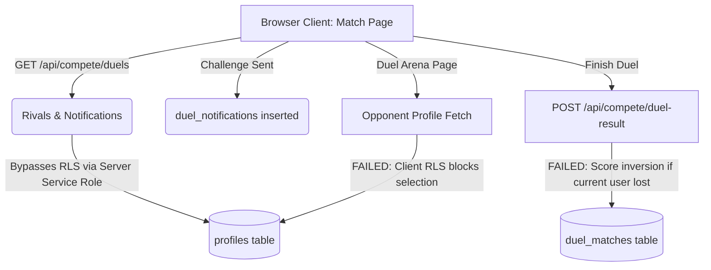

# LingoLoco Project Analysis & Audit

A comprehensive review of the LingoLoco codebase, focusing on the core business logic, the Compete/Ranking system, dynamic routing, database schema alignment, and UI/link consistency.

---

## 1. System Logic & Architecture Overview

LingoLoco is a Next.js application that integrates with Supabase for authentication, state tracking, and storage. The application uses Gemini (`gemini-1.5-flash` or the configured model) to generate practice exercises and flashcards dynamically.

### Core Modules
* **Onboarding & Roadmap**: Tracks the user's progress through 10 distinct sessions (7 sets each). Saves weekly XP, streak milestones, and session states.
* **Tutor Chat & Roleplay**: Allows users to chat with a simulated AI language partner under specific real-world scenarios.
* **Flashcards**: Standard swipe-style flashcards with text-to-speech support powered by browser APIs.
* **Compete System (1v1 Duels & Leaderboards)**: Includes matchmaking interfaces, live Elo updates, league promotions, and team/squad challenges.

---

## 2. The Compete System: Deep Dive & Logic Failures

The competitive module consists of 1v1 Arena Matches, weekly sprint tournaments, study squad challenges, and public leaderboards. However, the system's logic contains several critical flaws that prevent matches from running correctly.



### Critical RLS & Database Mismatches

#### A. Database Query Crashing in Global Leaderboard
* **Path**: [route.ts](file:///c:/Users/Jaineel/OneDrive/Desktop/lingoloco/app/api/compete/leaderboard/route.ts#L15)
* **Logic**: The API fetches the leaderboard by querying `user_rankings` and selecting a nested profile relation:
  ```typescript
  .select(`user_id, elo_rating, xp_this_week, league, wins, profiles(username, avatar_url)`)
  ```
* **Broken Thing**: The database migration [001_supabase_schema.sql](file:///c:/Users/Jaineel/OneDrive/Desktop/lingoloco/lib/db/migrations/001_supabase_schema.sql#L3) defines the `profiles` table with columns named `name` and `image`, **not** `username` and `avatar_url`. This column mismatch will cause the PostgREST query to crash, returning a `500` error for the global leaderboard.

#### B. Missing Database Tables for Tournaments
* **Path**: [page.tsx](file:///c:/Users/Jaineel/OneDrive/Desktop/lingoloco/app/compete/page.tsx#L37)
* **Broken Thing**: The compete page tries to fetch active tournaments from a `tournaments` table:
  ```typescript
  const { data: tournamentData } = await supabase.from('tournaments').select('ends_at')...
  ```
  However, no `tournaments` table exists in any database migration. This results in silent query failures or empty countdown banners.

#### C. Absolute RLS Block on Reading Opponent Profiles
* **Path**: [page.tsx](file:///c:/Users/Jaineel/OneDrive/Desktop/lingoloco/app/compete/duel/%5Bid%5D/page.tsx#L116)
* **Broken Thing**: The client-side page queries the `profiles` table directly to fetch both the user and the opponent:
  ```typescript
  supabase.from('profiles').select(...).eq('id', unwrappedParams.id)
  ```
  However, the RLS policies in [002_enable_rls_policies.sql](file:///c:/Users/Jaineel/OneDrive/Desktop/lingoloco/lib/db/migrations/002_enable_rls_policies.sql#L5) only allow users to read **their own** profile:
  ```sql
  create policy "profiles_select_own" on public.profiles for select to authenticated using (id = auth.uid());
  ```
  Since the opponent's ID is not equal to `auth.uid()`, this select query returns `null` or raises a permission exception. The page will immediately throw an "Opponent not found" error, halting the duel.

#### D. Missing SELECT and WRITE Policies for Duel Matches
* **Path**: [004_ranking_system.sql](file:///c:/Users/Jaineel/OneDrive/Desktop/lingoloco/lib/db/migrations/004_ranking_system.sql#L53)
* **Broken Thing**: The migration enables Row Level Security on the `duel_matches` table, but **no** policies are added for read or write actions. Because of this:
  1. The client is completely blocked from reading past matches, which halts session validation on load.
  2. Any client-facing interaction with `duel_matches` will trigger RLS policy violations.

---

### Matchplay & Game State Bugs

#### E. Eternal Duel Lockout (One-Match History Bug)
* **Path**: [page.tsx](file:///c:/Users/Jaineel/OneDrive/Desktop/lingoloco/app/compete/duel/%5Bid%5D/page.tsx#L132)
* **Broken Thing**: When the duel page loads, it fetches the most recent match between the two players:
  ```typescript
  const { data: existingMatches } = await supabase
    .from('duel_matches')
    .select('*')
    .or(`and(player1_id.eq.${user.id},player2_id.eq.${opponentId}),...`)
    .order('played_at', { ascending: false }).limit(1);
  ```
  If *any* match exists in history between these two players, the page immediately calls `applyResultRow()` and **redirects both users back to the compete page in 3 seconds**. As a result, two players can only ever play **one duel in their entire lifetime**; subsequent matches will immediately auto-finish and redirect.

#### F. Match Result Score Inversion
* **Path**: [route.ts](file:///c:/Users/Jaineel/OneDrive/Desktop/lingoloco/app/api/compete/duel-result/route.ts#L86)
* **Broken Thing**: When finishing a duel, the client sends `p1Score: myScore` and `p2Score: opponentScore`. The backend updates the record by setting:
  ```typescript
  player1_id: winnerId,
  player2_id: loserId,
  player1_score: p1Score,
  player2_score: p2Score,
  ```
  If the submitting user **lost** the match:
  * `player1_id` is assigned the **winner** (the opponent).
  * `player1_score` is assigned `p1Score` (the submitting user's lower score).
  This inverts the score values in the database, recording the winner with the lower score and the loser with the higher score!

#### G. Client-Initiated Duel Verification (Cheat Vulnerability)
* **Path**: [page.tsx](file:///c:/Users/Jaineel/OneDrive/Desktop/lingoloco/app/compete/duel/%5Bid%5D/page.tsx#L196)
* **Broken Thing**: The client-side code directly calculates the winner and submits the result to `/api/compete/duel-result`. There is no backend authorization/matchmaking check or secure handshake. Any user can easily submit HTTP requests to `/api/compete/duel-result` to spoof wins, boost Elo, and farm XP.

---

## 3. General Architecture, UI & Next.js Broken Things

Outside of the Compete system, several other routing, parameter unwrapping, and API-related bugs exist.

### Next.js Dynamic Parameters Crash
* **Path**: [page.tsx](file:///c:/Users/Jaineel/OneDrive/Desktop/lingoloco/app/roleplay/%5Bid%5D/result/page.tsx#L7)
* **Broken Thing**: Next.js 15/16 makes `params` a Promise for dynamic page components. While other pages handle this properly using the `use(params)` hook, the roleplay result page attempts to destructure `params` synchronously:
  ```typescript
  export default function RoleplayResult({ params }: { params: { id: string } })
  ```
  This will crash the build or trigger a runtime runtime exception in production.

### Broken Dashboard Routing (404 Navigations)
* **Paths**: 
  * [page.tsx](file:///c:/Users/Jaineel/OneDrive/Desktop/lingoloco/app/flashcards/page.tsx#L148) (Flashcards Back Link)
  * [TopNav.tsx](file:///c:/Users/Jaineel/OneDrive/Desktop/lingoloco/components/TopNav.tsx#L48) (Top Nav CTA button)
* **Broken Thing**: 
  * The flashcards page has several links redirecting back to `/dashboard` (e.g. `<Link href="/dashboard">`). However, `/dashboard` is a dynamic route configured as `/dashboard/[lang]`. This results in `404 Not Found` errors when navigating back.
  * The Top Navigation "Get Started" button points to `/start`, which does not exist in the codebase.

### Incorrect Gemini Model Configurations (Model 404s)
* **Paths**: 
  * [route.ts](file:///c:/Users/Jaineel/OneDrive/Desktop/lingoloco/app/api/practice/route.ts#L6)
  * [route.ts](file:///c:/Users/Jaineel/OneDrive/Desktop/lingoloco/app/api/chat/route.ts#L53)
* **Broken Thing**: The AI routes explicitly specify the generative model candidate `'gemini-2.5-flash'`. There is currently no model in the Gemini API named `gemini-2.5-flash` (valid ones are `gemini-1.5-flash` or `gemini-2.0-flash`). Attempts to trigger AI practice lessons or tutor chat sessions will throw model not found errors.

---

## 4. Priority Recommendation Matrix

To help systematically address these problems, here is the suggested implementation priority:

| Rank | Component | Issue | Severity | Impact |
| :--- | :--- | :--- | :--- | :--- |
| **1** | SQL & Auth | `profiles` RLS policy blocks opponent select; `user_rankings` schema mismatch | **CRITICAL** | Blocks duel matches entirely; crashes leaderboards. |
| **2** | Next.js | `roleplay` result params is treated as synchronous Promise | **CRITICAL** | App crash on compilation or build. |
| **3** | Compete Page | History check locks players after 1 match; score inversion on losses | **MAJOR** | Prevents replayability; corrupts match data. |
| **4** | UI Navigation | Flashcard and TopNav point to `/dashboard` and `/start` (404s) | **MAJOR** | User gets trapped on pages or hits 404 pages. |
| **5** | AI Services | Typo in Gemini model name (`gemini-2.5-flash` instead of `gemini-1.5-flash`) | **MAJOR** | AI services fail to respond. |
